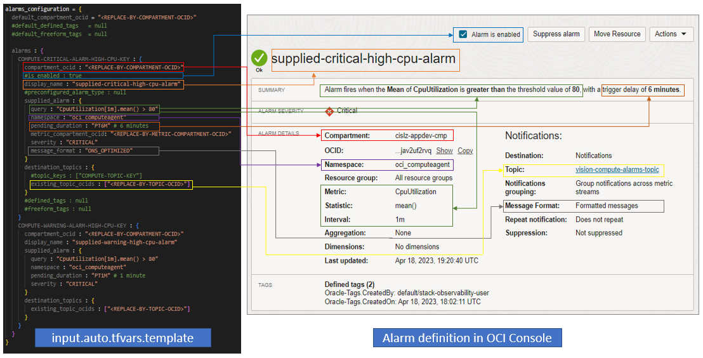

# CIS OCI Alarms Module Example - Supplied alarms

## Introduction

This example shows how to deploy Monitoring Alarms in OCI using the *supplied_alarm* attribute and an existing topic that is managed externally.

The picture below shows side by side how the various attributes in *alarms_configuration* variable within *input.auto.tfvars.template* map to the alarm definition in OCI (as shown in OCI Console). 



## Using this example
1. Rename *input.auto.tfvars.template* to *\<project-name\>.auto.tfvars*, where *\<project-name\>* is any name of your choice.

2. Within *\<project-name\>.auto.tfvars*, provide tenancy connectivity information and adjust the *alarms_configuration* input variable, by making the appropriate substitutions:
   - Replace *\<REPLACE-BY-COMPARTMENT-OCID\>*, *\<REPLACE-BY-METRIC-COMPARTMENT-OCID\>*, *\<REPLACE-BY-TOPIC-OCID\>* placeholders by appropriate compartment and topic OCIDs. 

Refer to [Alarms' module README.md](../../README.md) for overall attributes usage.

3. In this folder, run the typical Terraform workflow:
```
terraform init
terraform plan -out plan.out
terraform apply plan.out
```